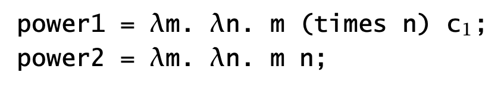

# Questions

## Representing natural numbers
- p. 67 defines natural numbers in terms of having zero and operations iszero, succ, and pred. Why these three operations? (That is, if you chose a different set of operations, could you accidentally allow for representations that behave unlike how we expect natural numbers to behave?)
- The reading and CIS 5000 talked a lot about natural number representation using z and s. I’m wondering what will be the complication for representing integers (negative value)?
    + EN: From my limited knowldge, the Peano axioms give us a simple way of constructing the natural numbers, which give us a nice induction principle (the naturals are the simplest non-trivial inductive datatype). The natural numbers also come with a well ordering $\leq$, which is useful for termination proofs. For example, in formal verification, we can prove loop termination by using *ranking functions* that map onto $\mathbb{N}$ and showing that the ranking function strictly decreases for each loop iteration -- this takes advantage of the fact that there is a least element in $(\mathbb{N}, \leq)$ (see CIS 6730 for more). However, $\mathbb{Z}$ isn't well-ordered according to the typical order (there is no least element) -- it is possible to define a  well-orderings on $\mathbb{Z}$, although this is non-trivial.   
    + See https://cstheory.stackexchange.com/questions/3772/why-naturals-instead-of-integers for a discussion on why the natural numbers are used more in PL theory textbooks compared to the integers

## Other datatype encodings
- Discuss how more complex data types such as lists can be encoded in the untyped lambda calculus   
    + EN: We'll discuss the Church & Scott encodings for lists in the slides!  
- It would be potentially interesting to walk through exp/power operation for church numerals
    + EN: (From TAPL Exercise 5.2.4) The functions `power1` and `power2` take in two Church numerals $m$ & $n$, and compute the quantity $m^n$ :           
             
    + Also see the discussion in https://stackoverflow.com/questions/47563925/church-naturals-exponentiation-function-and-type-checking
- I was wondering if anyone has proposed a definition for what the Church encoding of an arbitrary datastructure is? Or is it an “I know it when I see it situation”?            

## Y-combinator
- Do you have to use the Y-combinator to define factorial, or can you write it directly?         
- Walk through CBV vs CVN Y-combinators (if time allows)           

## Substitution
- When we describe a substitution operation as capture-avoiding, does that imply that it also solves the first problem on pg 70 (i.e., the same substitution in two alpha-equivalent terms should get alpha-equivalent results) in addition to the second problem (variable capture), or does it just mean exactly that the substitution avoids capture and nothing else?    
